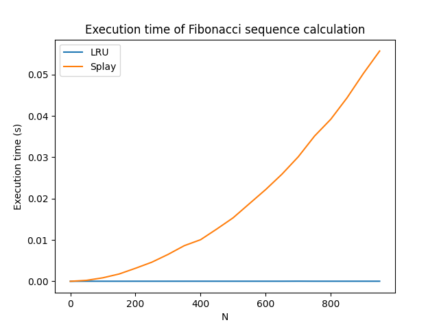

# goit-algo2-hw-07

## Завдання 1

Використання LRU кеша для оптимізації швидкості роботи програми показало, що виконання програми з кешем трохи повільніше, ніж без кешування. Це можливо через те, що в даному випадку кешування не допомагає зменшити кількість обчислень, а лише зберігає результати попередніх обчислень. Таким чином, виконання програми з кешем вимагає додаткових операцій збереження та відновлення даних з кешу.

Було порівняно кілька наборів вхідних даних, а також кілька варіантів реалізації.
`@lru_cache` не працює з мутабельними об'єктами, тому порівнювались підходи з використанням у функції масиву, що оголошений глобально (поза межами функції). Також для порівняння використовувалось приведнення типів даних до string і назад, що дозволяє використовувати `@lru_cache`.
Окрім цього, було змінено співвідношення операцій додавання та зміни елементів масиву - 90% операцій додавання та 10% зміни масиву, щоб збільшити ймовірність попадань в кеш.

Глобальні змінні:

```
n = 100, q = 50000
Час виконання без кешування: 0.02 секунд
Час виконання з LRU-кешем: 0.06 секунд, загальна кількість попадань в кеш: 47
n = 1000, q = 500000
Час виконання без кешування: 1.95 секунд
Час виконання з LRU-кешем: 2.29 секунд, загальна кількість попадань в кеш: 8
n = 100, q = 5000000
Час виконання без кешування: 2.46 секунд
Час виконання з LRU-кешем: 5.64 секунд, загальна кількість попадань в кеш: 4100
n = 10000, q = 5000000
Час виконання без кешування: 132.3 секунд
Час виконання з LRU-кешем: 104.36 секунд, загальна кількість попадань в кеш: 2
n = 100000, q = 50000
Час виконання без кешування: 8.78 секунд
Час виконання з LRU-кешем: 8.83 секунд, загальна кількість попадань в кеш: 0
```

Приведення типів (довелось зупинити через дуже довгий час виконання):

```
n = 100, q = 50000
Час виконання без кешування: 0.01 секунд
Час виконання з LRU-кешем: 0.74 секунд, загальна кількість попадань в кеш: 56
n = 1000, q = 500000
Час виконання без кешування: 1.14 секунд
Час виконання з LRU-кешем: 71.37 секунд, загальна кількість попадань в кеш: 6
n = 100, q = 5000000
Час виконання без кешування: 1.51 секунд
Час виконання з LRU-кешем: 73.54 секунд, загальна кількість попадань в кеш: 4046
n = 10000, q = 5000000
Час виконання без кешування: 100.77 секунд
...
```

Як висновок, можна сказати, що використання LRU кеша конкретно з запропонованими вхідними даними (щодо розміру масиву та кількості операцій) не допомагає зменшити час виконання програми, тому що не спостерігається попадання в кеш. Також використання кешування може збільшити час виконання програми через додаткові операції збереження та відновлення даних з кешу, а початкова функція, яку намагаємось кешувати, не вимагає великої кількості обчислень

---

## Завдання 2

```
Seed            LRU time (s)    Splay time (s)
---------------------------------------------
0               2.292e-06       1.458e-06      
50              2.1209e-05      0.000200208    
100             1.5708e-05      0.000723459    
150             1.4583e-05      0.001520667    
200             1.5208e-05      0.002498833    
250             1.4917e-05      0.004466167    
300             1.875e-05       0.005495959    
350             2.0417e-05      0.0075235      
400             2.2042e-05      0.009578334    
450             1.7208e-05      0.012211       
500             1.825e-05       0.01488025     
550             1.7334e-05      0.017936875    
600             1.8417e-05      0.021463916    
650             1.7959e-05      0.025882083    
700             4.8125e-05      0.029280041    
750             1.8167e-05      0.034683709    
800             1.9666e-05      0.038681125    
850             1.9208e-05      0.0440271251   
900             1.9791e-05      0.052376875    
950             1.9458e-05      0.053794375
```

Згідно графіку, час виконання функції з LRU кешем зростає лінійно, тоді як час виконання функції з Splay-деревом зростає квадратично. Це можливо через те, що в Splay-дереві відбувається більше операцій, ніж в LRU кеші, тому час виконання зростає швидше. Також можливо, що реалізація Splay-дерева не є оптимальною, тому що час виконання зростає квадратично.


